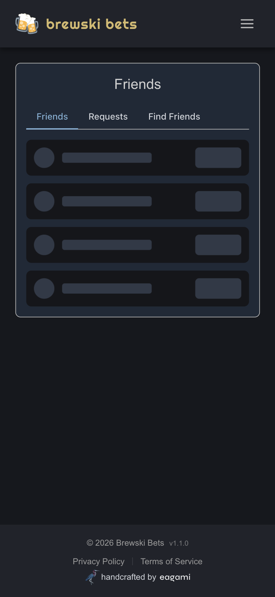
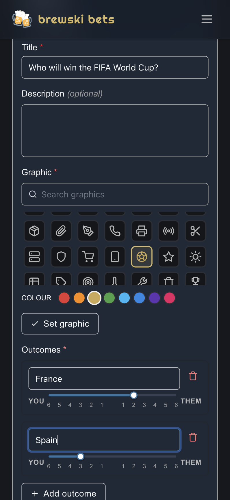
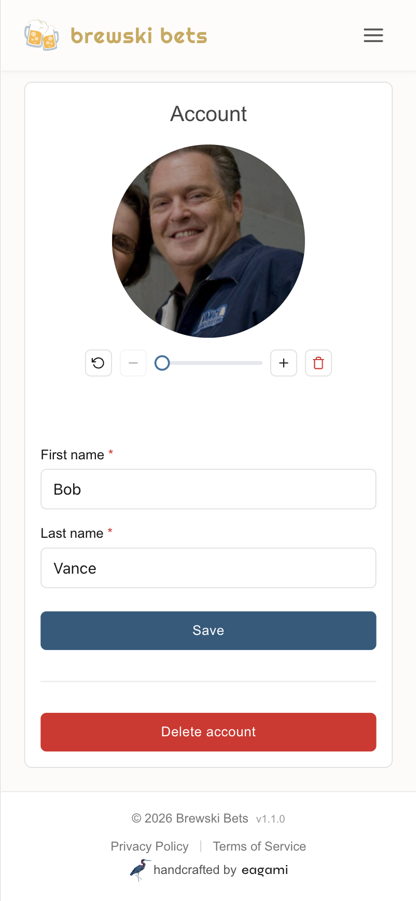

# 🍺 Brewski Bets

A tracker for casual bets between friends, settled in beer.

Live at **[brewskibets.com](https://brewskibets.com)**.

<table>
  <tr>
    <td width="33%"></td>
    <td width="33%"></td>
    <td width="33%"></td>
  </tr>
  <tr align="center">
    <td><sub><b>Friends list</b></sub></td>
    <td><sub><b>Create a bet</b></sub></td>
    <td><sub><b>Manage your account</b></sub></td>
  </tr>
</table>

---

## Features

| | |
|---|---|
| 🤝 **Two-party bets** | Negotiate terms back and forth: accept, edit, or reject |
| 🍺 **Brewski stakes** | A simple slider sets how many beers ride on each outcome |
| 📊 **Standings** | A running, per-friend beer balance with a breakdown of every bet behind it |
| 👥 **Friends** | Find people, send requests, and bet with anyone you've added |
| 🎨 **Personalize** | Organize bets with icons, letters, numbers, emojis, or country flags |
| 🌗 **Light & dark mode** | Looks great whatever the hour |
| 📱 **Works everywhere** | Responsive design for phone, tablet, and desktop |

---

## Tech stack

Built as a small, modern full-stack TypeScript app:

- **Frontend** — Angular (standalone components + signals), SCSS, the
  [`@eagami/ui`](https://www.npmjs.com/package/@eagami/ui) component library, and
  [Clerk](https://clerk.com) for authentication
- **Backend** — [Hono](https://hono.dev) API, [Drizzle ORM](https://orm.drizzle.team)
  over PostgreSQL ([Neon](https://neon.tech)), with avatars stored in
  [Cloudflare R2](https://developers.cloudflare.com/r2/)
- **Hosting** — [Vercel](https://vercel.com) (single-page app + serverless API functions)

---

## Project layout

```
brewski-bets/
├─ frontend/   # Angular single-page app
└─ backend/    # Hono API, Drizzle schema & migrations
```
